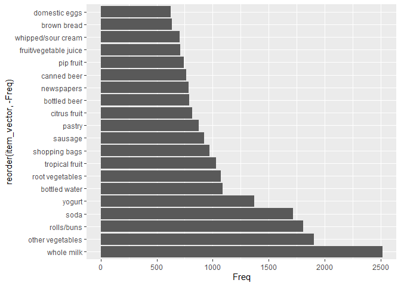
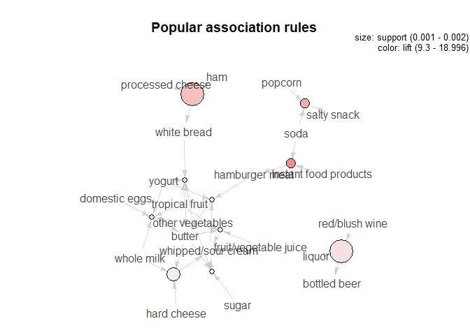

Association rule mining
================

The .txt file has data of **9,835** rows with each row being a list of
items seperated by commas and each row being a new basket.

Displaying a sample basket to check the contents and verify if they have
been extracted correctly

``` r
groceries[1,]   
```

    ## [1] "citrus fruit,semi-finished bread,margarine,ready soups"

Currently our data is just comma separated items with each row of our
data being one transaction. To use the transaction conversion function
we need indivudal baskets as a vector with the items from every
transaction.

Splitting items single strings from every basket into individual strings
of items and then displaying one row to
verify.

``` r
item_list = apply(groceries, MARGIN = 1, FUN = function(x){unlist(strsplit(x, ","))})
item_list[1]
```

    ## [[1]]
    ##                   V11                   V12                   V13 
    ##        "citrus fruit" "semi-finished bread"           "margarine" 
    ##                   V14 
    ##         "ready soups"

This is then converted to a vector by **unlisting**.

# How many items are present in our dataset?

``` r
length(unique(item_vector))  
```

    ## [1] 169

There are **169** unique items in our dataset.

# What is the most popular item?

``` r
ggplot(item_count %>% 
        arrange(-Freq) %>% 
        head(20), 
        aes(x = reorder(item_vector, -Freq), y = Freq)) + 
  geom_bar(stat = "identity") + 
  coord_flip() 
```

<!-- -->

The top 3 most commonly purchased items are **Whole
Milk**,**Vegetables** and **Rolls/Buns** in the same order.

# What are the 10 least popular items?

``` r
item_count %>%
  arrange(Freq) %>%
  head(10)
```

    ##              item_vector Freq
    ## 1              baby food    1
    ## 2   sound storage medium    1
    ## 3  preservation products    2
    ## 4                   bags    4
    ## 5        kitchen utensil    4
    ## 6         baby cosmetics    6
    ## 7         frozen chicken    6
    ## 8         toilet cleaner    7
    ## 9        make up remover    8
    ## 10        salad dressing    8

We then convert our items into transactions using the “as” function with
“transactions” as the second
argument.

# Applying the Apriori algorithm to identify the most popular associations:

The popular associations can be visualised as
below:

``` r
plot(head(groceryrules, n = 10, by ="lift"), method = "graph", main = "Popular association rules")
```

<!-- -->

# Conclusions:

A few of the most common purchases or inferences are:

1.  People purchasing **Instant food products** and **soda** are more
    likely to get **hamburger meat** too.

2.  **Cheese, ham, white bread** and **eggs** usually sell together.

3.  **Popcorn, soda** are sold popularly with **salty snacks** (possible
    movie/game night meals).

4.  A lot of dairy like **cheese, curd, whipped cream and yogurt** are
    purchased together.
