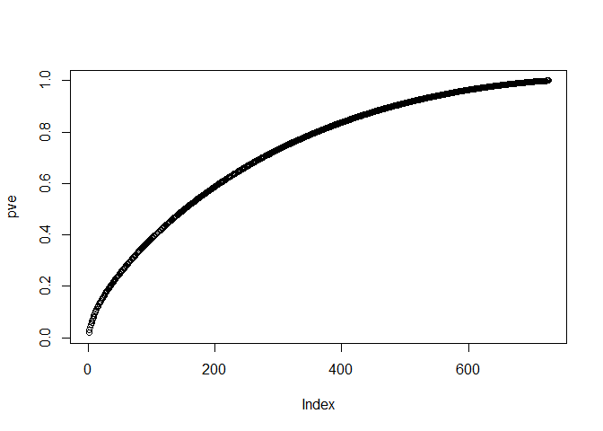

Author Attribution
================

In this markdown file we built a model, using different tools, for
predicting the author of an article on the basis of that article’s
textual content.

Installing all libaries needed for analysis:

Defining readerPlain function to read plain text documents in English:

``` r
readerPlain = function(fname){
  readPlain(elem=list(content=readLines(fname)), 
            id=fname, language='en') }
# Train data
# Read in all the files
file_list = Sys.glob('C:/Users/alish/Desktop/MSBA/Github/Coursework/STA-380-Exercise-master/ReutersC50/C50train/*/*.txt')

Reuters_Files = lapply(file_list, readerPlain) 

file_list_test = Sys.glob('C:/Users/alish/Desktop/MSBA/Github/Coursework/STA-380-Exercise-master/ReutersC50/C50test/*/*.txt')
Reuters_Files_test = lapply(file_list_test, readerPlain) 
```

Cleaning the file names:

``` r
mynames = file_list %>%
  { strsplit(., '/', fixed=TRUE) } %>%
  { lapply(., tail, n=2) } %>%
  { lapply(., paste0, collapse = '') } %>%
  unlist

mynames_test = file_list_test %>%
  { strsplit(., '/', fixed=TRUE) } %>%
  { lapply(., tail, n=2) } %>%
  { lapply(., paste0, collapse = '') } %>%
  unlist
```

``` r
author_train = file_list %>%
  {strsplit(., '/', fixed=TRUE)}%>%
  { lapply(., function(x)x[11]) }%>% #you might have to change x[5] depending on which directory your  file is in
  { lapply(., paste0, collapse = '') } %>%
  unlist
author_test = file_list_test %>%
  {strsplit(., '/', fixed=TRUE)}%>%
  { lapply(., function(x)x[11]) }%>%
  { lapply(., paste0, collapse = '') } %>%
  unlist
```

We now need to create a corpus:

``` r
documents_raw = Corpus(VectorSource(Reuters_Files))
documents_raw_test = Corpus(VectorSource(Reuters_Files_test))
```

    ## Warning in tm_map.SimpleCorpus(my_documents, content_transformer(tolower)):
    ## transformation drops documents

    ## Warning in tm_map.SimpleCorpus(my_documents,
    ## content_transformer(removeNumbers)): transformation drops documents

    ## Warning in tm_map.SimpleCorpus(my_documents,
    ## content_transformer(removePunctuation)): transformation drops documents

    ## Warning in tm_map.SimpleCorpus(my_documents,
    ## content_transformer(stripWhitespace)): transformation drops documents

    ## Warning in tm_map.SimpleCorpus(my_documents,
    ## content_transformer(removeWords), : transformation drops documents

    ## Warning in tm_map.SimpleCorpus(my_documents_test,
    ## content_transformer(tolower)): transformation drops documents

    ## Warning in tm_map.SimpleCorpus(my_documents_test,
    ## content_transformer(removeNumbers)): transformation drops documents

    ## Warning in tm_map.SimpleCorpus(my_documents_test,
    ## content_transformer(removePunctuation)): transformation drops documents

    ## Warning in tm_map.SimpleCorpus(my_documents_test,
    ## content_transformer(stripWhitespace)): transformation drops documents

    ## Warning in tm_map.SimpleCorpus(my_documents_test,
    ## content_transformer(removeWords), : transformation drops documents

Removing terms that have count 0 in \>95% of docs. Terms that occur this
rarely are unlikely to reveal attributes unique to an author:

``` r
DTM_Reuters = removeSparseTerms(DTM_Reuters, 0.95)
DTM_Reuters
```

    ## <<DocumentTermMatrix (documents: 2500, terms: 801)>>
    ## Non-/sparse entries: 280686/1721814
    ## Sparsity           : 86%
    ## Maximal term length: 18
    ## Weighting          : term frequency (tf)

``` r
DTM_Reuters_test = removeSparseTerms(DTM_Reuters_test, 0.95)
DTM_Reuters_test
```

    ## <<DocumentTermMatrix (documents: 2500, terms: 816)>>
    ## Non-/sparse entries: 285048/1754952
    ## Sparsity           : 86%
    ## Maximal term length: 18
    ## Weighting          : term frequency (tf)

Next steps done were:

construct TF IDF weights.

Running PCA to reduce number of features.

We considered 700 as the optimum PCA importance.

``` r
tfidf_Reuters = weightTfIdf(DTM_Reuters)
X = as.matrix(tfidf_Reuters)
X = X[,-which(colSums(X)==0)]

tfidf_Reuters_test = weightTfIdf(DTM_Reuters_test)
X_test = as.matrix(tfidf_Reuters_test)
X_test = X_test[,-which(colSums(X_test)==0)]

y = author_train

X_test = X_test[,intersect(colnames(X_test),colnames(X))]
X = X[,intersect(colnames(X_test),colnames(X))]

pca_train = prcomp(X, scale=TRUE)
pve = summary(pca_train)$importance[3,]
plot(pve)
```

<!-- -->

``` r
#pca_test = prcomp(X_test, scale=TRUE)
loading_train = pca_train$rotation[,1:700]
pca_test = scale(X_test) %*% loading_train


X_train = pca_train$x[,1:700]
train = as.data.frame(X_train)
train['y'] = y

test = as.data.frame(pca_test)
test['y'] = author_test
```

Trying KNN model:

Best accuracy is **57%** for KNN with k=5.

Random Forest:

Best accuracy is **42%** for 100 trees.

Naive Bayes:

Best accuracy with Naive Bayes is **28%**.

Let’s try **LDA**:

Best accuracy is **58%**.

## Conclusion:

Text is an unstructured data format and therefore requires several
pre-processing steps to turn it into a more structured form.

After pre-processing, we extracted TF-IDF values from all documents to
find characteristics unique to an author.

We removed terms that were sparingly used because this long-tail of
words added unnecessary complexity to the analysis, without a
proportional improvement in classification accuracy.

Using PCA, we reduced the number of features in order to make the
problem computationally less expensive.

We used models such as KNN, Random Forest, LDA etc to classify articles
to their authors.

We noticed that the best accuracy was obtained using an LDA model, which
gave us 58% accuracy.
