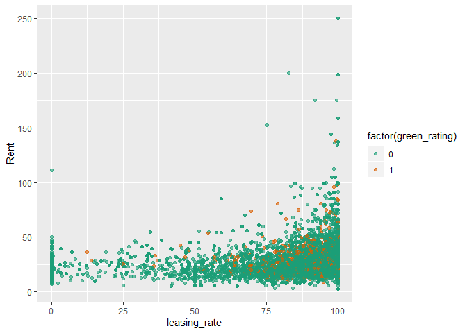
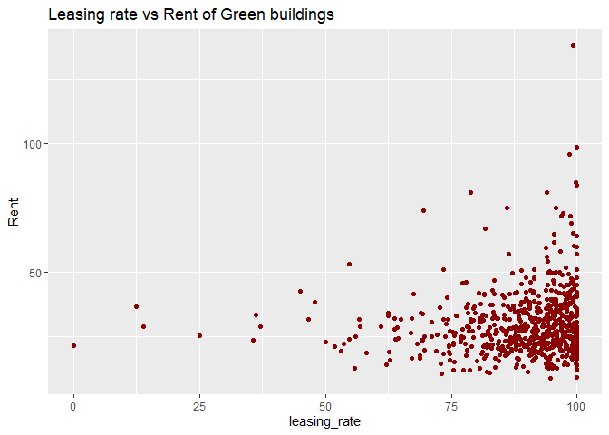
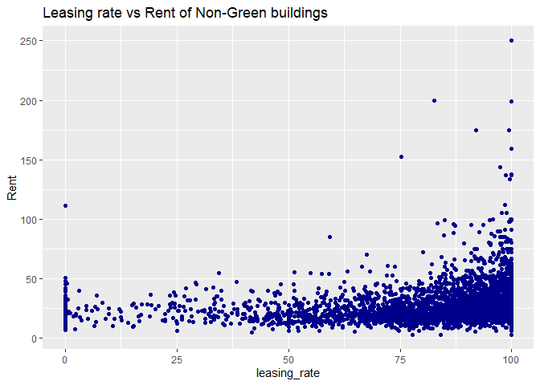
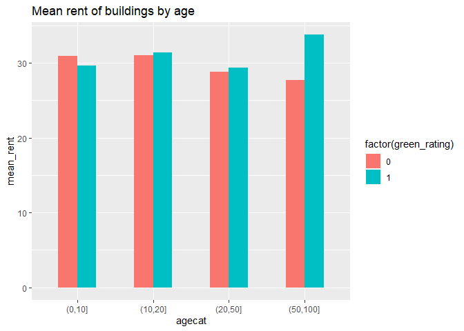
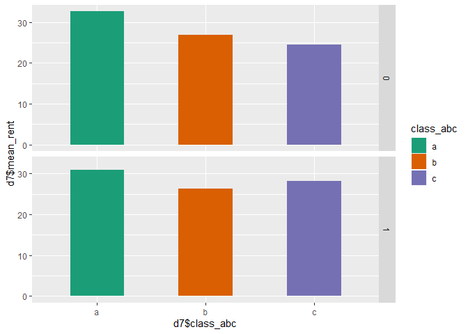

Green Buildings
================

## Visual story telling

This markdown file contains a detailed exploratory analysis of green
building to analyse if a green building is financially more feasible
than a non-green building

First step is to read in the data and summarize it. We also check for
missing values

``` r
datagb = read.csv("greenbuildings.csv")
attach(datagb)
#Take a summary of the data and check for missing values
kable(sapply(datagb, function(x) sum(is.na(x))))
```

<table>

<thead>

<tr>

<th style="text-align:left;">

</th>

<th style="text-align:right;">

x

</th>

</tr>

</thead>

<tbody>

<tr>

<td style="text-align:left;">

CS\_PropertyID

</td>

<td style="text-align:right;">

0

</td>

</tr>

<tr>

<td style="text-align:left;">

cluster

</td>

<td style="text-align:right;">

0

</td>

</tr>

<tr>

<td style="text-align:left;">

size

</td>

<td style="text-align:right;">

0

</td>

</tr>

<tr>

<td style="text-align:left;">

empl\_gr

</td>

<td style="text-align:right;">

74

</td>

</tr>

<tr>

<td style="text-align:left;">

Rent

</td>

<td style="text-align:right;">

0

</td>

</tr>

<tr>

<td style="text-align:left;">

leasing\_rate

</td>

<td style="text-align:right;">

0

</td>

</tr>

<tr>

<td style="text-align:left;">

stories

</td>

<td style="text-align:right;">

0

</td>

</tr>

<tr>

<td style="text-align:left;">

age

</td>

<td style="text-align:right;">

0

</td>

</tr>

<tr>

<td style="text-align:left;">

renovated

</td>

<td style="text-align:right;">

0

</td>

</tr>

<tr>

<td style="text-align:left;">

class\_a

</td>

<td style="text-align:right;">

0

</td>

</tr>

<tr>

<td style="text-align:left;">

class\_b

</td>

<td style="text-align:right;">

0

</td>

</tr>

<tr>

<td style="text-align:left;">

LEED

</td>

<td style="text-align:right;">

0

</td>

</tr>

<tr>

<td style="text-align:left;">

Energystar

</td>

<td style="text-align:right;">

0

</td>

</tr>

<tr>

<td style="text-align:left;">

green\_rating

</td>

<td style="text-align:right;">

0

</td>

</tr>

<tr>

<td style="text-align:left;">

net

</td>

<td style="text-align:right;">

0

</td>

</tr>

<tr>

<td style="text-align:left;">

amenities

</td>

<td style="text-align:right;">

0

</td>

</tr>

<tr>

<td style="text-align:left;">

cd\_total\_07

</td>

<td style="text-align:right;">

0

</td>

</tr>

<tr>

<td style="text-align:left;">

hd\_total07

</td>

<td style="text-align:right;">

0

</td>

</tr>

<tr>

<td style="text-align:left;">

total\_dd\_07

</td>

<td style="text-align:right;">

0

</td>

</tr>

<tr>

<td style="text-align:left;">

Precipitation

</td>

<td style="text-align:right;">

0

</td>

</tr>

<tr>

<td style="text-align:left;">

Gas\_Costs

</td>

<td style="text-align:right;">

0

</td>

</tr>

<tr>

<td style="text-align:left;">

Electricity\_Costs

</td>

<td style="text-align:right;">

0

</td>

</tr>

<tr>

<td style="text-align:left;">

cluster\_rent

</td>

<td style="text-align:right;">

0

</td>

</tr>

</tbody>

</table>

Thus we can see that only emp\_gr column has missing values.

Next we check to see if there are outliers in the rent for green and
non-green buildings.

``` r
median_1 <- median(datagb$Rent[datagb$green_rating == 1])
median_0 <- median(datagb$Rent[datagb$green_rating == 0])
ggplot(data = datagb, aes(x = as.factor(green_rating), y = Rent)) +
  geom_boxplot(aes(x=green_rating, y = Rent, group= green_rating, fill = as.factor(green_rating))) + 
  scale_fill_manual(c("Green Building"), labels = c("No", "Yes"), values = c('darkblue', 'darkgreen')) +
  scale_x_discrete("Green Rating") +
  geom_text(data = data.frame(x = 0, y = median_1),
            aes(x, y), label = median_1, hjust = -2, vjust = -1, colour = "darkgreen") +
  geom_text(data = data.frame(x = 0, y = median_0),
            aes(x, y), label = median_0, hjust = -1, vjust = 1.5, colour = "darkblue") +
  ggtitle("Rent vs Green Rating")
```

<!-- -->

From the above plot we can see that the rent for non-green building
might be skewed due to many outliers above 50 and so we look at the
median rents. The median rent for green buildings is higher than
non-green buildings by (27.6-25) = **2.6$/sqft**

Now let us check how the leasing rate affects the rent for green and non
green buildings:

``` r
ggplot(data = datagb)+
  geom_point(aes( leasing_rate, Rent,color = factor(green_rating)), alpha = 0.6)+
  scale_color_brewer(palette="Dark2")
```

<!-- -->

There seems to be a high concentration between 0-10%. Let’s plot the
leasing rate separately for green and non green:

``` r
par(mfrow=c(2,2))
ggplot(data = subset(datagb, datagb$green_rating ==1))+
  geom_point(aes( leasing_rate, Rent,color = factor(green_rating)), color="darkred")+
  ggtitle("Leasing rate vs Rent of Green buildings")
```

<!-- -->

``` r
ggplot(data = subset(datagb, datagb$green_rating ==0))+
  geom_point(aes( leasing_rate, Rent,color = factor(green_rating)), color="darkblue")+
  ggtitle("Leasing rate vs Rent of Non-Green buildings")
```

<!-- -->

Thus we see, for non-green buildings, there are **leasing rates less
than 10%**. Let us ignore these buildings as we have to compare with
green buildings:

``` r
datagb <-subset(datagb, datagb$leasing_rate >10)
```

Since most green- buildings are young, rent should be higher than
non-green buildings. First, let us plot the number of green and
non-green buildings based on age:

``` r
datagb = datagb %>%
  mutate(agecat = cut(age, c(0,10,20,50,100)))
#summary(datagb)
datagb = na.omit(datagb)
d3 = datagb %>%
  group_by(green_rating, agecat) %>%tally
ggplot(data= d3, aes(agecat,n, fill = factor(green_rating)))+
  geom_bar(stat='identity',width=0.5, position=position_dodge())+
  ggtitle("Number of buildings based on age")
```

<!-- -->

In general there are more non green buildings than green buidings and
they are also older than the green buildings

Now, let us plot the mean age for green vs non green:

``` r
d4 = datagb %>%
  group_by(green_rating, agecat) %>%
  summarise(mean_rent = mean(Rent))
ggplot(data= d4, aes(agecat,mean_rent, fill = factor(green_rating)))+
  geom_bar(stat='identity',width=0.5, position=position_dodge())+
  ggtitle("Mean rent of buildings by age")
```

<!-- -->

Only in the first 10 years the avg rent of green buildings is higher
than non-green. Additionally, as the age is increasing, rent for green
is increasing, but decreasing for non- green buildings.

Now, let us also consider the leasing rate. We will plot the occupancy
rate in green and non-green buildings according to age:

``` r
d5 = datagb %>%
  group_by(green_rating, agecat) %>%
  summarise(mean_leasing = mean(leasing_rate))
ggplot(data= d5, aes(agecat,mean_leasing, fill = factor(green_rating)))+
  geom_bar(stat='identity',width=0.5, position=position_dodge())+
  ggtitle("Mean Leasing rate of buildings by age")
```

<!-- -->

In general the mean leasing rate is more for green buildings than
non-green and is above 80%. Let us find the mean leasing rate of green
and non-green buildings:

``` r
mean_leasing1 <- mean(datagb$leasing_rate[datagb$green_rating == 1])
mean_leasing0 <- mean(datagb$leasing_rate[datagb$green_rating == 0])
```

The average leasing rate for green buildings is **89.4690045** and that
of non-green building is **85.0593375**.

This implies that even though the initial cost are higher for a green
building, in years to come the rent as well as the leasing rate will be
higher for green buildings, thus allowing us the get a ROI.

Now let us look at what role class plays here. Let us plot the number of
buildings vs classes:

``` r
d6 = datagb %>%
  group_by(green_rating, class_b, class_a) %>%tally
d6$class_abc = ifelse(d6$class_a ==0 & d6$class_b ==0, 'c',
                      ifelse(d6$class_a ==1,'a','b'))
ggplot(data = d6)+
  geom_bar(aes(class_abc,n,fill = d6$class_abc), stat='identity',width=0.5, position=position_dodge())+
  facet_grid(d6$green_rating)+scale_fill_brewer(palette="Set1")
```

<!-- -->

We see that most of the green buildings belong to class A and there are
more class B non-green buildings than Class A

Let us plot class vs Rent. We see that the rent of class A buildings
have a higher rent

``` r
datagb$class_abc = ifelse(datagb$class_a ==0 & datagb$class_b ==0, 'c',
                      ifelse(datagb$class_a ==1,'a','b'))
d7 = datagb %>%
  group_by(green_rating, class_abc) %>%
  summarise(mean_rent = mean(Rent))
ggplot(data = d7)+
  geom_bar(aes(d7$class_abc, d7$mean_rent, fill = class_abc),
           stat='identity',width=0.5, position=position_dodge())+
  facet_grid(d7$green_rating)+scale_fill_brewer(palette="Dark2")
```

<!-- -->

We can see that if the building is in class A, the rent will be higher
irrespective of whether it is a green building or not.

Let us see the numbers now:

The rent obtained from a green building, considering average leasing
rate is:

``` r
rent_green = 250000*(median_1)*mean_leasing1/100
rent_nongreen = 250000*(median_0)*mean_leasing0/100
excess_rent = rent_green - rent_nongreen
additional_charges = 5000000
years_to_recover = additional_charges/excess_rent
```

We find the excess rent that we would get from a green building to be
**$8.571527210^{5}**.

Thus, considering the $5M additional charge that goes into a green
building, we would take **5.8332662** years to recover the extra cost.

Let us keep in mind that the rent as well as leasing rate increases for
green buildings as it gets older and hence we agree with the excel
expert that it will be a good financial decision to build a green
building.
