Market Segmentation
================

In this markdown file, we try to analyze our data and cluster it based
on the customers online activity so that our client can approach the
market in a more segmented
fashion

#### Loading libraries

## EDA on DATA:

#### Plotting summaries and checking for null values in each of the columns

    ##  [1] X                chatter          current_events   travel          
    ##  [5] photo_sharing    uncategorized    tv_film          sports_fandom   
    ##  [9] politics         food             family           home_and_garden 
    ## [13] music            news             online_gaming    shopping        
    ## [17] health_nutrition college_uni      sports_playing   cooking         
    ## [21] eco              computers        business         outdoors        
    ## [25] crafts           automotive       art              religion        
    ## [29] beauty           parenting        dating           school          
    ## [33] personal_fitness fashion          small_business   spam            
    ## [37] adult           
    ## <0 rows> (or 0-length row.names)

    ## [1] "unique ids"

    ##          X           chatter       current_events      travel      
    ##  123pxkyqj:   1   Min.   : 0.000   Min.   :0.000   Min.   : 0.000  
    ##  12grikctu:   1   1st Qu.: 2.000   1st Qu.:1.000   1st Qu.: 0.000  
    ##  12klxic7j:   1   Median : 3.000   Median :1.000   Median : 1.000  
    ##  12t4msroj:   1   Mean   : 4.399   Mean   :1.526   Mean   : 1.585  
    ##  12yam59l3:   1   3rd Qu.: 6.000   3rd Qu.:2.000   3rd Qu.: 2.000  
    ##  132y8f6aj:   1   Max.   :26.000   Max.   :8.000   Max.   :26.000  
    ##  (Other)  :7876                                                    
    ##  photo_sharing    uncategorized      tv_film      sports_fandom   
    ##  Min.   : 0.000   Min.   :0.000   Min.   : 0.00   Min.   : 0.000  
    ##  1st Qu.: 1.000   1st Qu.:0.000   1st Qu.: 0.00   1st Qu.: 0.000  
    ##  Median : 2.000   Median :1.000   Median : 1.00   Median : 1.000  
    ##  Mean   : 2.697   Mean   :0.813   Mean   : 1.07   Mean   : 1.594  
    ##  3rd Qu.: 4.000   3rd Qu.:1.000   3rd Qu.: 1.00   3rd Qu.: 2.000  
    ##  Max.   :21.000   Max.   :9.000   Max.   :17.00   Max.   :20.000  
    ##                                                                   
    ##     politics           food            family        home_and_garden 
    ##  Min.   : 0.000   Min.   : 0.000   Min.   : 0.0000   Min.   :0.0000  
    ##  1st Qu.: 0.000   1st Qu.: 0.000   1st Qu.: 0.0000   1st Qu.:0.0000  
    ##  Median : 1.000   Median : 1.000   Median : 1.0000   Median :0.0000  
    ##  Mean   : 1.789   Mean   : 1.397   Mean   : 0.8639   Mean   :0.5207  
    ##  3rd Qu.: 2.000   3rd Qu.: 2.000   3rd Qu.: 1.0000   3rd Qu.:1.0000  
    ##  Max.   :37.000   Max.   :16.000   Max.   :10.0000   Max.   :5.0000  
    ##                                                                      
    ##      music              news        online_gaming       shopping     
    ##  Min.   : 0.0000   Min.   : 0.000   Min.   : 0.000   Min.   : 0.000  
    ##  1st Qu.: 0.0000   1st Qu.: 0.000   1st Qu.: 0.000   1st Qu.: 0.000  
    ##  Median : 0.0000   Median : 0.000   Median : 0.000   Median : 1.000  
    ##  Mean   : 0.6793   Mean   : 1.206   Mean   : 1.209   Mean   : 1.389  
    ##  3rd Qu.: 1.0000   3rd Qu.: 1.000   3rd Qu.: 1.000   3rd Qu.: 2.000  
    ##  Max.   :13.0000   Max.   :20.000   Max.   :27.000   Max.   :12.000  
    ##                                                                      
    ##  health_nutrition  college_uni     sports_playing      cooking      
    ##  Min.   : 0.000   Min.   : 0.000   Min.   :0.0000   Min.   : 0.000  
    ##  1st Qu.: 0.000   1st Qu.: 0.000   1st Qu.:0.0000   1st Qu.: 0.000  
    ##  Median : 1.000   Median : 1.000   Median :0.0000   Median : 1.000  
    ##  Mean   : 2.567   Mean   : 1.549   Mean   :0.6392   Mean   : 1.998  
    ##  3rd Qu.: 3.000   3rd Qu.: 2.000   3rd Qu.:1.0000   3rd Qu.: 2.000  
    ##  Max.   :41.000   Max.   :30.000   Max.   :8.0000   Max.   :33.000  
    ##                                                                     
    ##       eco           computers          business         outdoors      
    ##  Min.   :0.0000   Min.   : 0.0000   Min.   :0.0000   Min.   : 0.0000  
    ##  1st Qu.:0.0000   1st Qu.: 0.0000   1st Qu.:0.0000   1st Qu.: 0.0000  
    ##  Median :0.0000   Median : 0.0000   Median :0.0000   Median : 0.0000  
    ##  Mean   :0.5123   Mean   : 0.6491   Mean   :0.4232   Mean   : 0.7827  
    ##  3rd Qu.:1.0000   3rd Qu.: 1.0000   3rd Qu.:1.0000   3rd Qu.: 1.0000  
    ##  Max.   :6.0000   Max.   :16.0000   Max.   :6.0000   Max.   :12.0000  
    ##                                                                       
    ##      crafts         automotive           art             religion     
    ##  Min.   :0.0000   Min.   : 0.0000   Min.   : 0.0000   Min.   : 0.000  
    ##  1st Qu.:0.0000   1st Qu.: 0.0000   1st Qu.: 0.0000   1st Qu.: 0.000  
    ##  Median :0.0000   Median : 0.0000   Median : 0.0000   Median : 0.000  
    ##  Mean   :0.5159   Mean   : 0.8299   Mean   : 0.7248   Mean   : 1.095  
    ##  3rd Qu.:1.0000   3rd Qu.: 1.0000   3rd Qu.: 1.0000   3rd Qu.: 1.000  
    ##  Max.   :7.0000   Max.   :13.0000   Max.   :18.0000   Max.   :20.000  
    ##                                                                       
    ##      beauty          parenting           dating            school       
    ##  Min.   : 0.0000   Min.   : 0.0000   Min.   : 0.0000   Min.   : 0.0000  
    ##  1st Qu.: 0.0000   1st Qu.: 0.0000   1st Qu.: 0.0000   1st Qu.: 0.0000  
    ##  Median : 0.0000   Median : 0.0000   Median : 0.0000   Median : 0.0000  
    ##  Mean   : 0.7052   Mean   : 0.9213   Mean   : 0.7109   Mean   : 0.7677  
    ##  3rd Qu.: 1.0000   3rd Qu.: 1.0000   3rd Qu.: 1.0000   3rd Qu.: 1.0000  
    ##  Max.   :14.0000   Max.   :14.0000   Max.   :24.0000   Max.   :11.0000  
    ##                                                                         
    ##  personal_fitness    fashion        small_business        spam        
    ##  Min.   : 0.000   Min.   : 0.0000   Min.   :0.0000   Min.   :0.00000  
    ##  1st Qu.: 0.000   1st Qu.: 0.0000   1st Qu.:0.0000   1st Qu.:0.00000  
    ##  Median : 0.000   Median : 0.0000   Median :0.0000   Median :0.00000  
    ##  Mean   : 1.462   Mean   : 0.9966   Mean   :0.3363   Mean   :0.00647  
    ##  3rd Qu.: 2.000   3rd Qu.: 1.0000   3rd Qu.:1.0000   3rd Qu.:0.00000  
    ##  Max.   :19.000   Max.   :18.0000   Max.   :6.0000   Max.   :2.00000  
    ##                                                                       
    ##      adult        
    ##  Min.   : 0.0000  
    ##  1st Qu.: 0.0000  
    ##  Median : 0.0000  
    ##  Mean   : 0.4033  
    ##  3rd Qu.: 0.0000  
    ##  Max.   :26.0000  
    ## 

There are no null values There are no duplicate ids Based on the summary
above, it looks like the range, median and mean of the columns in my
data are more or less the same, except for spam, dating and adult
\#\#\#\# Plotting frequency distribution across categories
<!-- -->
\#\#\#\# Plotting some scatter plots to see if there are any good amount
of outliers present in my data which can effect the clustering
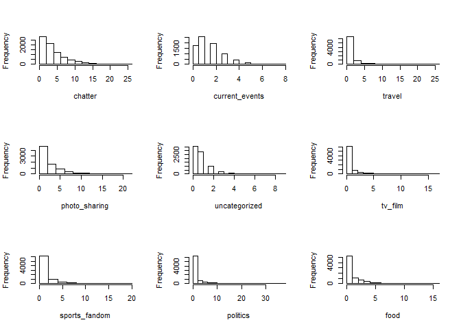<!-- -->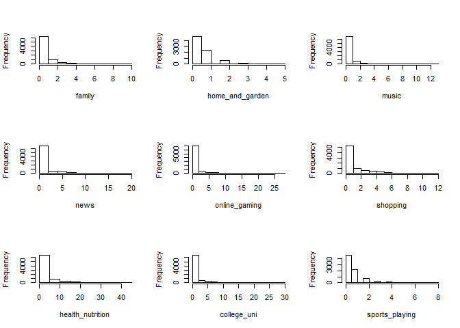<!-- --><!-- --><!-- -->
Based on the plots and summary above, we can see that the range of my
columns are more or less the same, also there are no such bunch of
outliers present which can hamper my clustering, so it would not be a
waste of time to run clustering on unscaled data as well We can also try
iterations with removing spam and adult variables \#\# PROCEDURE: Post
EDA, following models were tried : - Kmeans - Heirarchical Clustering -
Kmeans++ - RUnning the above three on PCA components

Each of the above Iteration were tried on SCALED DATA, UNSCALED DATA and
NORMALIZED DATA (Reason written in EDA section)

For every iteration, the optimum number of clusters were determined (K)
by guessing a range from “Elbow Curve” plots, “CH Index” plots and GAP
Statistics. After running through each value of K, the properties of
cllusters were determined by ploting boxplots of every variable across
each cluster. Suppose the median,upper range and lower range of a
particular cluster for a particular variable was coming out to be
significantly high or low, we used to assign a property based on the
variable to that cluster. For example, after running an iteration of
Kmeans with K = 5, and plotting box plots of all the 5 clusters across a
variable “travel”, my second cluster’s box plot had higher values, we
would say people in cluster 2 generally tend to comment more on travel
related categories After running these methods, certain scatter plots
were drawn to see how distinctly we are able to identify the clusters
Based on the distribution of data across clusters, business use case and
extent of distinction, few of the following models are chosen. \#\# K
means on scaled data with K = 7 \#\#\#\# For the scaled data running
K-means \#\#\#\# Plotting an elbow curve  
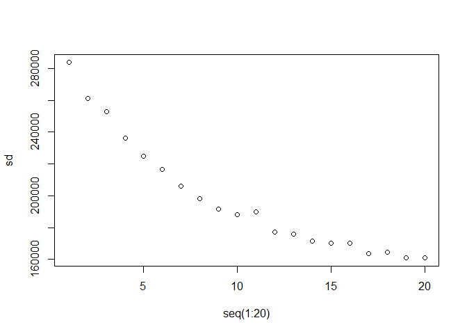<!-- -->
\#\#\#\# Plotting with CH Index
<!-- -->
\#\#\#\# Plotting GAP Statistics
<!-- -->

#### Trying different iterations and running K means with 7

<!-- -->
\#\#\#\# Plotting box plots
<!-- --><!-- -->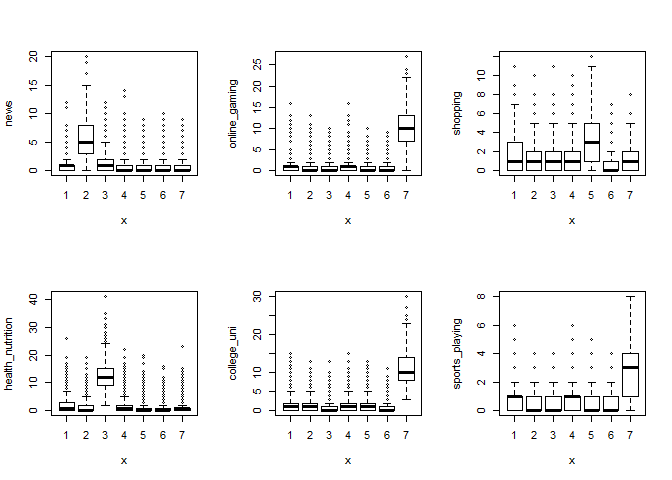<!-- -->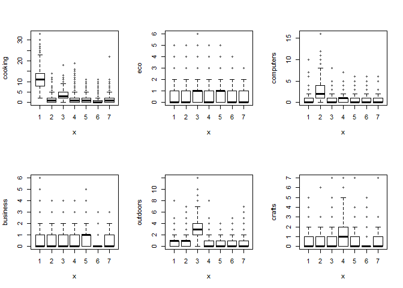<!-- --><!-- -->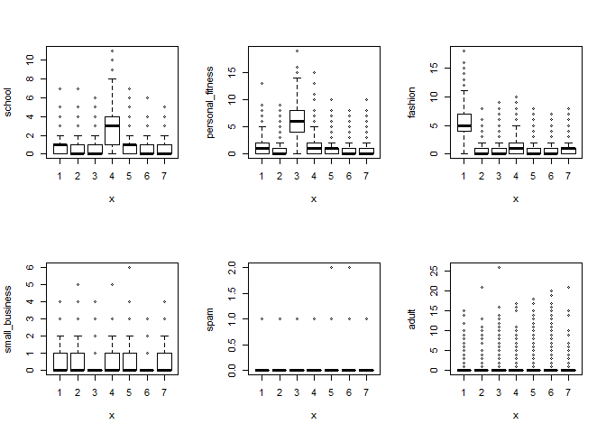<!-- -->
Based on the plots above we can bucket aur audience into following
audience: Class 1(Trendy class) : These people generally talk about
fashion, beauty, pic sharing and cooking generally. Class 2(Technical
and knowledge sharing) : Automative, computers, news, politics and
travel are topics generally discussed Class 3(Health Conscious) :
Personal Fitting, outdoor, health\_nutrition and food (might be
discussing about healthy food and suppliments) Class 4(Family persons):
School, parenting, religion, family, food and sports fandom Class
5(Instagram People): Shopping, TV Films, shopping, pic sharing and
chatter Class 7(College people) : Arts, sports\_playing, college\_uni
and online gaming
<!-- --><!-- --><!-- -->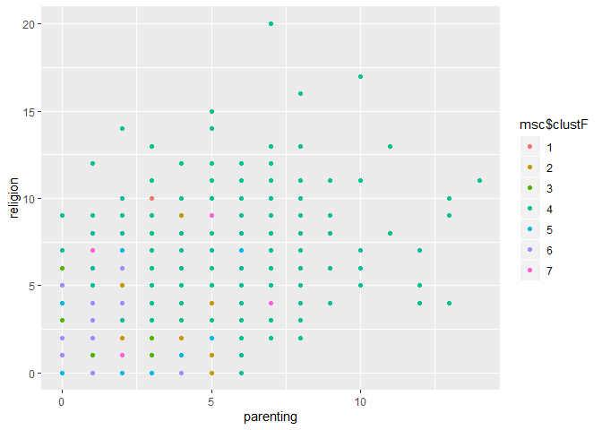<!-- -->
In first plot we can see how our class 3 ( health conscious) tend to
post most about health nutirition and personal fitness Second plot shows
majority of our class 1 population talking about beauty Third plot shows
our college people talking about college\_uni and online gaming Forth
plot shows our “Family Person” class 4 talking majorly about religion
and parenting \#\# Kmeans++ on unscaled data with K = 12 \#\#\#\# Have
removed columns adult and spam
<!-- -->
\#\#\#\# Plotting with CH Index
<!-- -->
\#\# Plotting using Gap Statistics
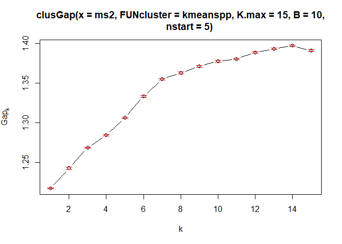<!-- -->
\#\#\#\# Kmeanspp for K = 12
<!-- -->
\#\#\#\# Plotting box plots
<!-- --><!-- -->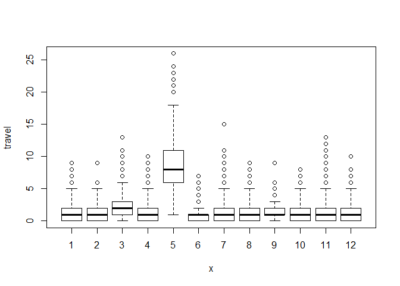<!-- --><!-- --><!-- --><!-- -->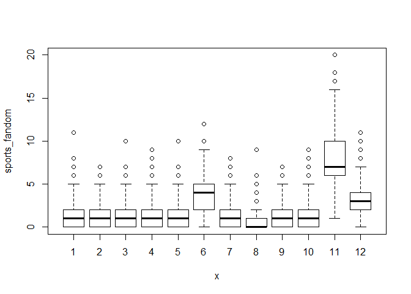<!-- -->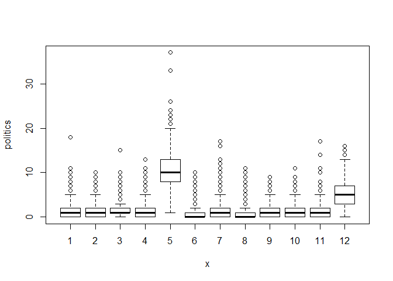<!-- -->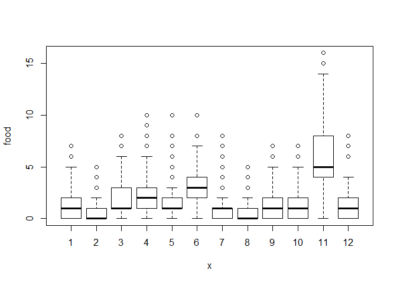<!-- -->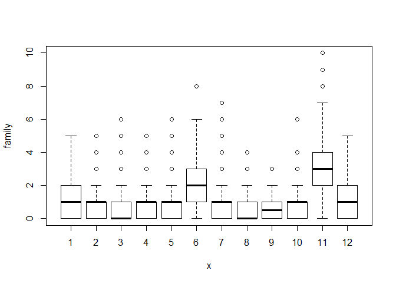<!-- -->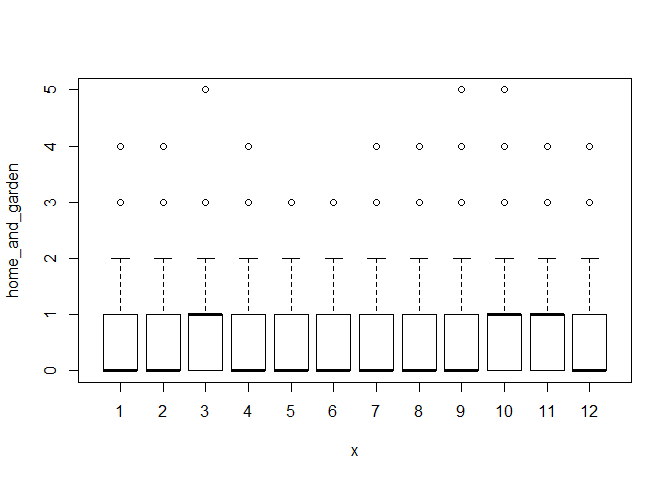<!-- -->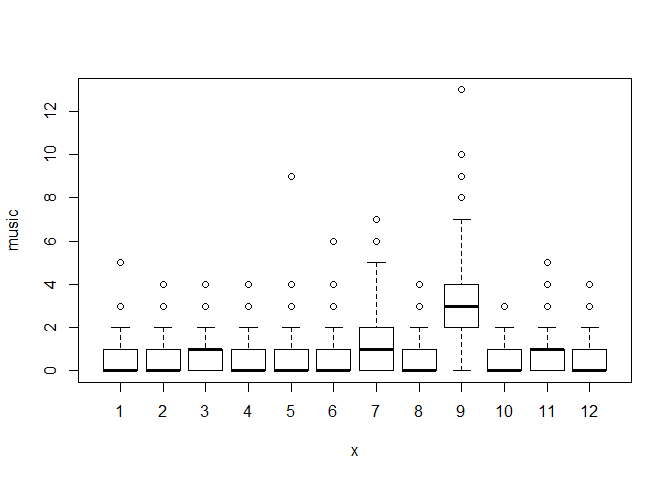<!-- -->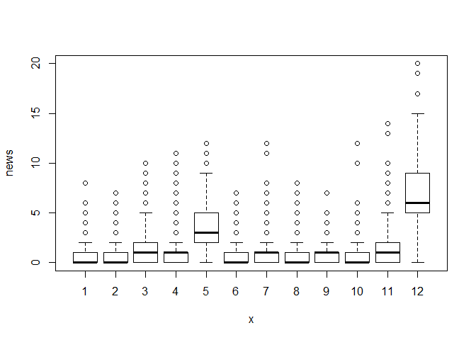<!-- --><!-- --><!-- --><!-- --><!-- -->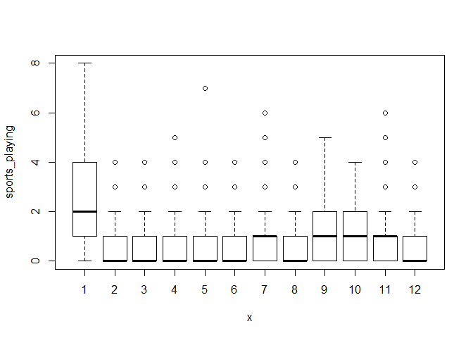<!-- --><!-- --><!-- --><!-- --><!-- --><!-- --><!-- --><!-- -->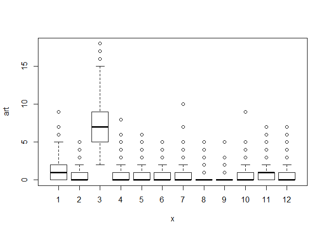<!-- --><!-- -->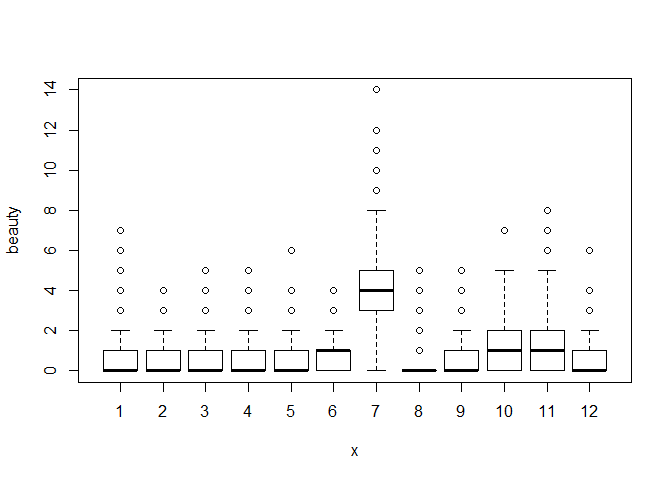<!-- --><!-- --><!-- -->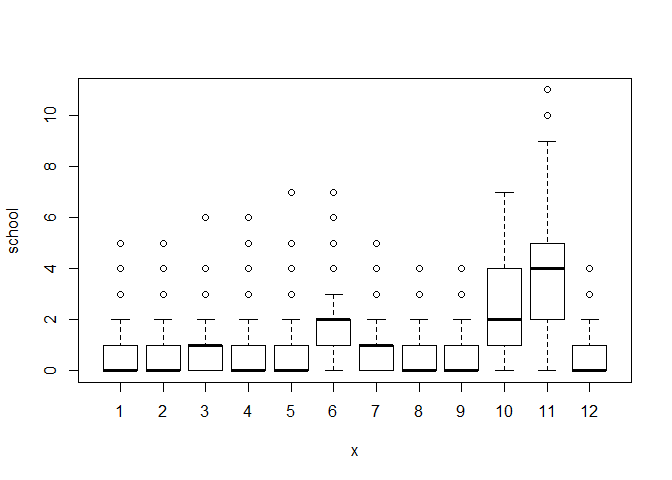<!-- -->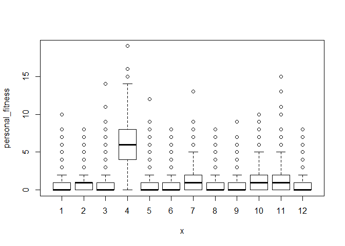<!-- -->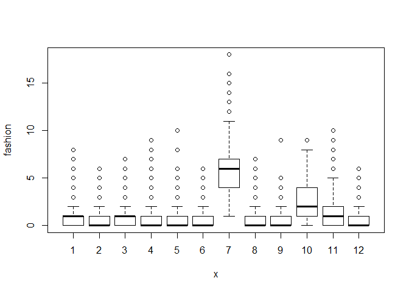<!-- --><!-- --><!-- -->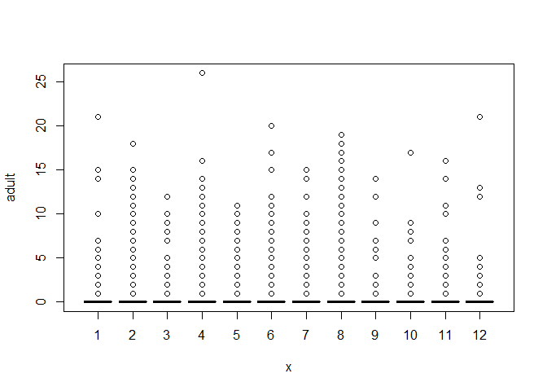<!-- -->
Based on the model above we can segment our audience into following
categories: - Class 1 ( College people) : They usually talk about
playing sports, online gaming and college uni - Class 2 (Shopping enthu)
: They are high in topics realted to shopping, pic sharing and chatter -
Class 3 (Artistic) : Art and tv\_films are generally topics of
discussion - Class 4( Health Freaks) : personal\_fitness, outdoors,
health\_nutrition - Class 5( Tech and news) : Computers, news ,politics
and travel are majority topics - Class 6( Family people) : Parenting,
Family and religion - Class 7 : Fashion, Beauty, Cooking and Photo
Sharing - Class 9( Teenage) : Topics of discussion are school, dating
and chatter - Class 10 (Family People): School, Parenting, Family,
Religion, food, sports\_fandon - Class 12 (News) : Automotive, news and
politics \#\#\#\# Drawing some scatter plots
<!-- -->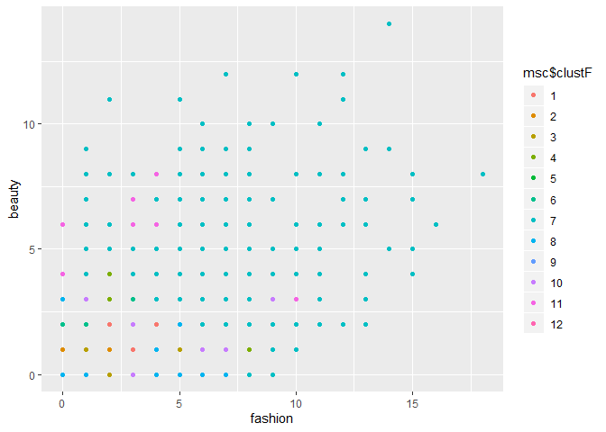<!-- --><!-- -->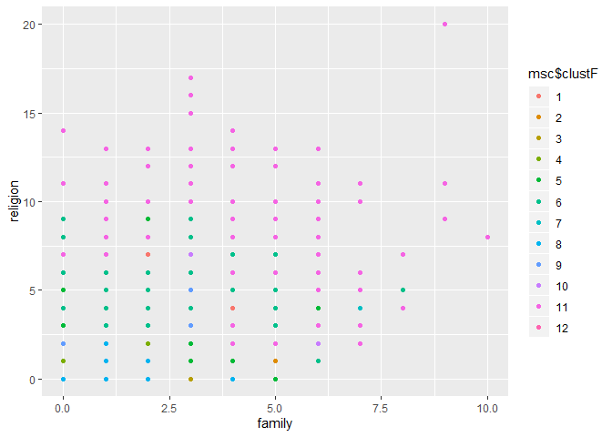<!-- --><!-- -->
In the first plot we can see our Class 3 being dominant as they are
health freak people In the second plot we can see people from Class 7
talking about beauty and fashion In the third plot we see our students
pots In fourth plot and fifth plot we can see lot of class 8 and 6
people but class 8 is dominant \#\#CONCLUSION: After iterating over
several techniques and parameters, above two gave the best resuts.
However, the problem in both cases is that we are unable to classify
properly the class which has major chunk of data in it.

We evaluated clusters based on the box plots and scatter plots.

In 1st method, the mojrity chunk in which we were unable to cluster them
properly consisted of 3500 records , but for the ones we did, we could
show for attributes attached to those classes, majority of the data
points in their scatter plot belonged to them.

In 2nd method, we were unable to give good properties to cluster 8. For
cluster 6, some properties were getting tied up to it but i scatter
plots we saw that those properties were getting overshadowed due to
other classes, so we can say the model did not clustered by class 6
properly. Thus there are total 4500 which do not have any specific
property. Thus we will go with 1st model and classify our audience
accordingly.
