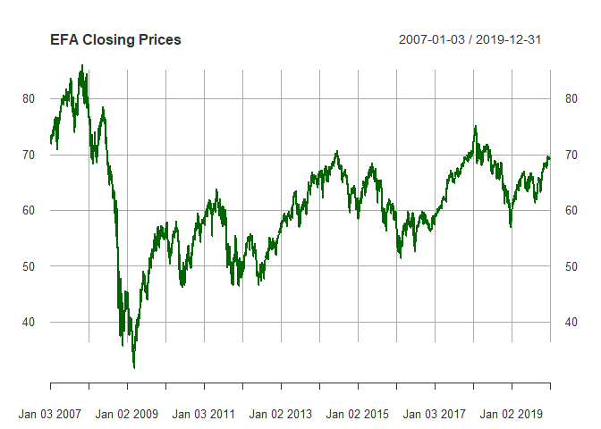

Portfolio Modelling
================

In this markdown file we will construct three different portfolios of
exchange-traded funds, or ETFs, and use bootstrap resampling to analyze
the short-term tail risk of your portfolios.

First let us import few stocks. We will choose stocks such that few are
volatile and few are stable. Also we chose stocks which have more than 5
years of data.

1.  Find stocks to put in your EFT
2.  Plot the trends for the past 5 years to see which ones are volatile
    and which ones are stable
3.  Decide the weightes for all 3 portfolios
4.  Create a function to calculate the VAR at the end of 4 weeks
    Function:
5.  Build a loop to resample the returns day by day and add a
    rebalancing at the end of the loop
6.  Build another loop to perform monte carlo simulations

Stocks were selected from the top 100 most heavily traded exchange
products.

``` r
mystocks = c("EEM", "QQQ", "SPY", "EFA", "XOP")
getSymbols(mystocks)
```

    ## 'getSymbols' currently uses auto.assign=TRUE by default, but will
    ## use auto.assign=FALSE in 0.5-0. You will still be able to use
    ## 'loadSymbols' to automatically load data. getOption("getSymbols.env")
    ## and getOption("getSymbols.auto.assign") will still be checked for
    ## alternate defaults.
    ## 
    ## This message is shown once per session and may be disabled by setting 
    ## options("getSymbols.warning4.0"=FALSE). See ?getSymbols for details.

    ## [1] "EEM" "QQQ" "SPY" "EFA" "XOP"

To adjust for splits and divedends, we use the adjustOLHC package which
is part of the quantmod() library.

``` r
adjusted_stocks = lapply(mystocks, function(i) {
  adjustOHLC(get(i, pos=.GlobalEnv), symbol.name=i, adjust=c("split"), 
             use.Adjusted=FALSE)
})

all_returns = cbind(ClCl(EEM),ClCl(QQQ),ClCl(SPY),ClCl(EFA),ClCl(XOP))
#head(all_returns)
all_returns = as.matrix(na.omit(all_returns))
summary(all_returns)
```

    ##     ClCl.EEM             ClCl.QQQ             ClCl.SPY         
    ##  Min.   :-0.1616620   Min.   :-0.0895567   Min.   :-0.0984477  
    ##  1st Qu.:-0.0083710   1st Qu.:-0.0046929   1st Qu.:-0.0039118  
    ##  Median : 0.0008098   Median : 0.0009900   Median : 0.0005702  
    ##  Mean   : 0.0002307   Mean   : 0.0005722   Mean   : 0.0003256  
    ##  3rd Qu.: 0.0087729   3rd Qu.: 0.0069027   3rd Qu.: 0.0055392  
    ##  Max.   : 0.2276986   Max.   : 0.1216475   Max.   : 0.1451977  
    ##     ClCl.EFA             ClCl.XOP         
    ##  Min.   :-1.116e-01   Min.   :-0.1796222  
    ##  1st Qu.:-5.509e-03   1st Qu.:-0.0122123  
    ##  Median : 5.876e-04   Median : 0.0006704  
    ##  Mean   : 8.589e-05   Mean   : 0.0001572  
    ##  3rd Qu.: 6.496e-03   3rd Qu.: 0.0130154  
    ##  Max.   : 1.589e-01   Max.   : 0.2191988

``` r
#par(mfrow = c(3, 2))
colours = c('dark red', 'dark cyan','blue','dark green','orange')
for (i in seq_along(mystocks)) {
  df_expr = paste(mystocks[i],"$",mystocks[i],".Close", sep = "")
  data = eval(parse(text = df_expr))
  plot = plot(data, col = colours[i], type = "l", main = paste(mystocks[i],"Closing Prices"))
  print(plot)
}
```

<!-- --><!-- --><!-- --><!-- --><!-- -->

Let us look at the standard deviation to judge the volatility

``` r
stdev_stocks = data.frame()
for (i in 1:ncol(all_returns))
{
 s = sd(all_returns[, i], na.rm = T)
 stdev_stocks[1,i] =  s
}
colnames(stdev_stocks) = colnames(all_returns)
stdev_stocks
```

    ##     ClCl.EEM   ClCl.QQQ   ClCl.SPY   ClCl.EFA   ClCl.XOP
    ## 1 0.01918985 0.01305129 0.01217139 0.01437589 0.02405534

Looks like **EEM** and **XOP** are the most volatile stocks.

Now to build the function to calculate the variance:

``` r
days = 20
initial_wealth = 10000
func_wealthtracker = function(weights){
  wealthtracker = matrix(0, nrow = 5000, ncol = days)
  for (i in 1:5000) {
  wealth = initial_wealth
    for (day in 1:20) {
      wealth = initial_wealth
      splits = weights*wealth
      sample.day = resample(all_returns, 1, orig.ids = FALSE)
      return = splits+splits*sample.day
      wealth = sum(return)
      wealthtracker[i,day] <- wealth
    }}
  wealthtracker
}
```

``` r
#plot the histogram for the first portfolio
weights1 = c(0.2, 0.2, 0.2, 0.2, 0.2)
data1 = func_wealthtracker(weights1)
ggplot(mapping = aes(data1[,days]-initial_wealth)) +
  geom_histogram(bins = 30, fill = 'black') +
  labs(x = "Profit",
       y = "Frequency",
       title = "VAR - Strategy 1",
       subtitle = "")
```

<!-- -->

``` r
quantile(data1[,days] - initial_wealth, 0.05)
```

    ##        5% 
    ## -228.5584

Thus, from a portfolio where the weights are evenly distributed, we get
a VAR of -228.5584383. Additionally, we get an average profit of
1.000310^{4}.

Now let us see a safer portfolio, where we put lesser weight on the 2
volatile stocks

``` r
weights2 = c(0.05, 0.3, 0.3, 0.3, 0.05)
data2 = func_wealthtracker(weights2)
ggplot(mapping = aes(data2[,days]-initial_wealth)) +
  geom_histogram(bins = 30, fill = 'black') +
  labs(x = "Profit",
       y = "Frequency",
       title = "VAR - Strategy 2",
       subtitle = "")
```

<!-- -->

``` r
quantile(data2[,days] - initial_wealth, 0.05)
```

    ##        5% 
    ## -196.3642

Thus, from a safer portfolio, we get a VAR of **-196.3641641**.
Additionally, we get an average profit of **1.000310^{4}**.

Next, we will make a more risky portfolio, adding weight on the more
volatile stocks

``` r
weights3 = c(0.25, 0.2, 0.2, 0.1, 0.25)
data3 = func_wealthtracker(weights2)
ggplot(mapping = aes(data3[,days]-initial_wealth)) +
  geom_histogram(bins = 30, fill = 'black') +
  labs(x = "Profit",
       y = "Frequency",
       title = "VAR - Strategy 3",
       subtitle = "")
```

<!-- -->

``` r
quantile(data3[,days] - initial_wealth, 0.05)
```

    ##        5% 
    ## -200.0032

Thus, from a safer portfolio, we get a VAR of **-200.0031699**.
Additionally, we get an average profit of **1.000510^{4}**.
