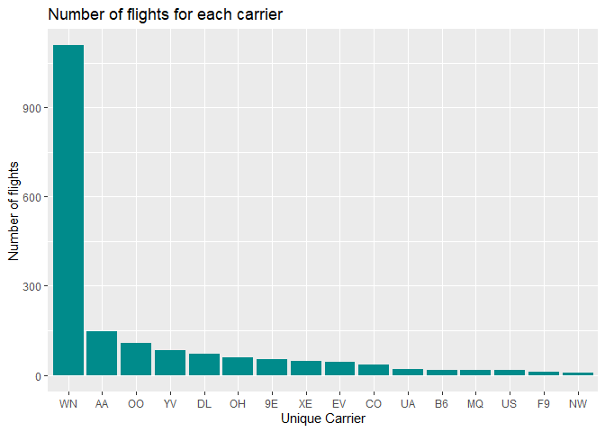
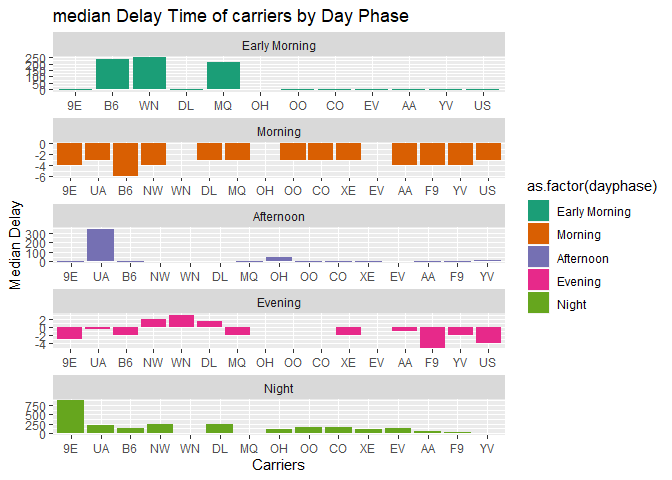
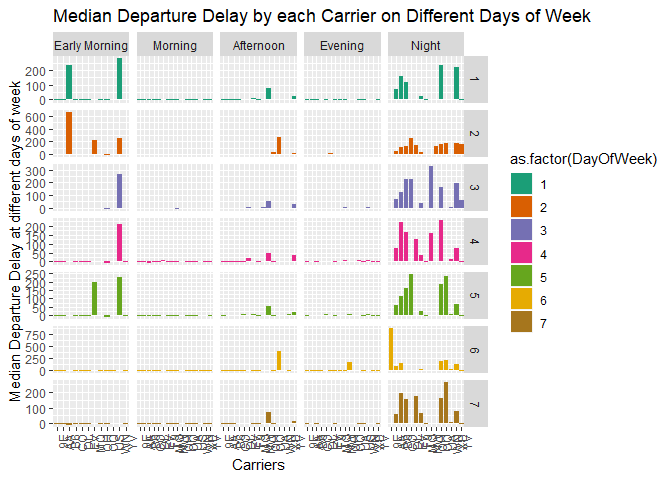
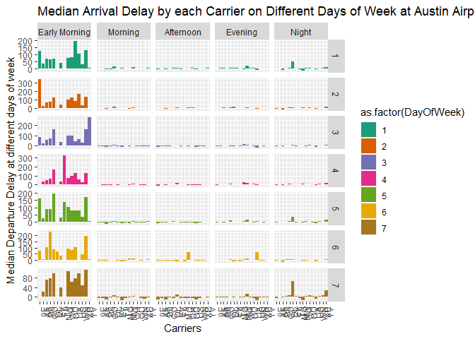
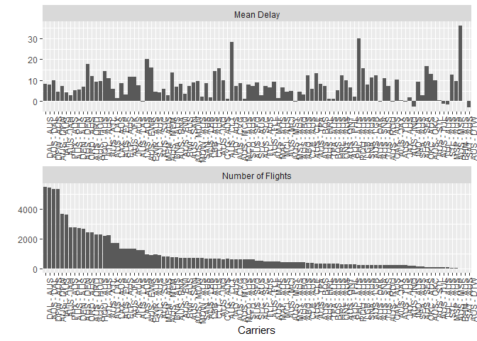
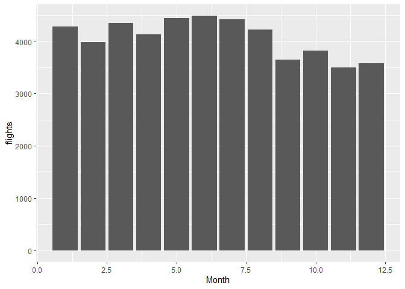

Flights at ABIA
================

# Visual story telling

This markdown file contains a detailed exploratory analysis of flight
data at the Austin ABIA Airport and derives interesting findings for the
same

## Reading the files Abia and airport codes

#### Data Cleaning and Manupulation

## Adding another column “day\_phase” and “day\_phase\_arr” which groups the deperature time and arrival time into following groups:

#### If time is between 0:00 to 6:00 then its early morning

#### If time is between 6:00 to 12:00 then its is morning

#### If the time is between 12:00 to 15:00 then it is afternoon

#### If the time is between 15:00 to 20:00 then it is evening

#### from 20:00 to 0:00 it is night

Moving ahead and doing EDA on ABIA data only

The unique carriers
    are:

    ##  [1] "9E" "AA" "YV" "NW" "CO" "XE" "B6" "WN" "UA" "OO" "OH" "EV" "US" "MQ"
    ## [15] "F9" "DL"

The unique origins
    are:

    ##  [1] "MEM" "AUS" "MCI" "LAX" "ELP" "JFK" "ORD" "MSY" "SAN" "IAH" "ATL"
    ## [12] "DFW" "IAD" "LAS" "CLE" "BWI" "BOS" "ONT" "LBB" "TPA" "DAL" "PHX"
    ## [23] "ABQ" "SFO" "JAX" "SJC" "MCO" "CVG" "SLC" "HOU" "DEN" "BNA" "STL"
    ## [34] "HRL" "EWR" "OKC" "TUL" "SNA" "MAF" "TUS" "RDU" "MSP" "MDW" "SAT"
    ## [45] "TYS" "BHM" "PHL" "SEA" "LGB" "FLL" "IND" "CLT" "OAK"

## Plotting total number of flights per carrier and operating per airport

<!-- -->

We can see that the my carrier “WN” has one of the busiest flights
having most number of them departing from Austin. By checking on google,
it tells me these are South West
Airlines.

#### Finding out the average delay time in departure from Austin Airport per carrier per phase of the day

<!-- -->

We can see that : \#\#\#\# Finding out the average delay time in
departure from Austin Airport per carrier per phase of the day
<!-- -->

In the plot above, the grid is telling me at each day of week, what is
the average delay time of my carriers in different phases of the day. We
can see that generally, the nights have the major delays in departures
at the Austin Airports
.

#### Filtering for arrivals to Austin Airport and running the analysis again

<!-- -->

We can see from the plot above that generally flights coming at early
morning tend to arrive late.

## Plotting some extra graphs to see further general trends:

<!-- -->

We can see that the flights between IAD and AUS are the ones which fly
on regular basis and are constantly delayed. Perhaps upon increasing the
number of flights or changing the routes might solve the
problem.

#### Plotting average delay and number of flights based on monthly basis:

<!-- -->

## Conclusion :

  - The South West Airlines has majority of carriers operating at the
    Austin Airport.

  - Generally, at any given day of the week, the departures at the Early
    Morning (till 6am) are the busiest for Arrivals, and at Evenings,
    its the departures which are delayed the most. So if you are
    travelling from Austin, avoid booking an evening flight and if you
    are travelling to Austin, try to avoid a flight which arrives early
    morning.

  - Generally, the airline service between Dulles, Washington (IAD) and
    Austin is generally delayed. Probably increasing the number of
    aircrafts might change the scenario.
